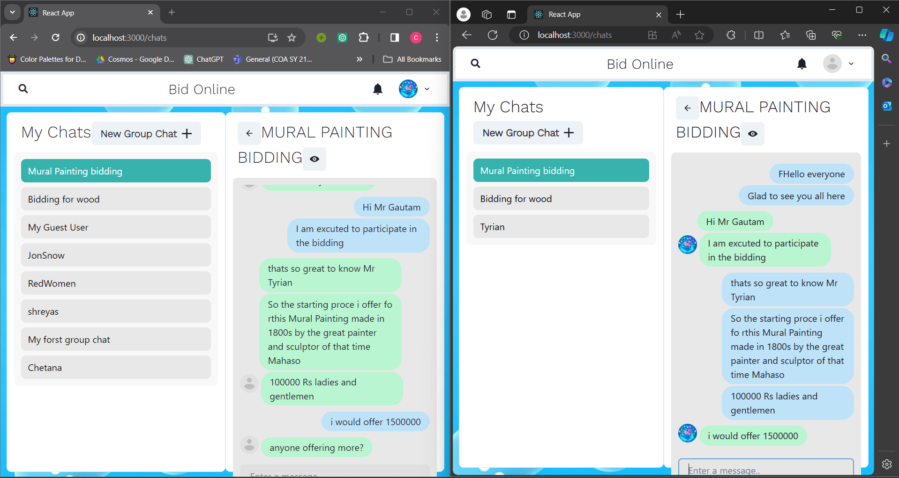

# BidEase: Empowering E-Commerce Auctions



BidEase is an innovative online bidding platform designed to revolutionize the e-commerce auction experience. Inspired by successful online auctions, such as gifts presented to Prime Minister Narendra Modi, BidEase aims to provide users with a seamless and engaging bidding environment.

## Development Status

BidEase is currently under active development. The following functionalities have been implemented and are being refined:

- **Real-Time Chatting:** Users can engage in real-time conversations with each other, facilitating communication between buyers and sellers.
- **Secure Password Storage:** User passwords are securely hashed and stored to ensure data security and privacy.
- **One-to-One and Group Chats:** Users can initiate both one-to-one and group chats, enabling collaborative discussions and negotiations.

## Key Features

- **Real-Time Bidding:** Users can place bids in real-time, with instant updates on the current highest bid.
- **Secure Communication:** A built-in chat system ensures secure communication between buyers and sellers, fostering trust and transparency.
- **AI Price Prediction:** Integrated AI technology provides users with price predictions based on historical data, helping them make informed bidding decisions.
- **Scalability:** The platform is designed to handle a large volume of users and items, ensuring smooth and uninterrupted auction experiences.
- **Secure Payments:** BidEase prioritizes user security by implementing robust payment processing systems, safeguarding transactions against fraud and unauthorized access.

## Installation

1. Clone the repository:
   ```bash
   git clone https://github.com/Chetana21/BidChatter.git
   ```
2. Navigate to the project directory:
   ```bash
   cd BidChatter
   ```
3. Start the backend server:
   ```bash
   npm start
   ```
4. Navigate to the frontend directory:
   ```bash
   cd frontend
   ```
5. Start the frontend server:
   ```bash
   npm start
   ```

## Usage

Once both the backend and frontend servers are running, you can access BidEase at [http://localhost:3000](http://localhost:3000). From there, you can explore the various auction listings, place bids, and engage in real-time conversations with sellers.

## Technologies Used

- JavaScript
- Node.js
- Express.js
- MongoDB
- React.js
- Chakra UI


## Contact

If you have any questions or feedback about BidEase, feel free to contact me at pchetana691@gmail.com
